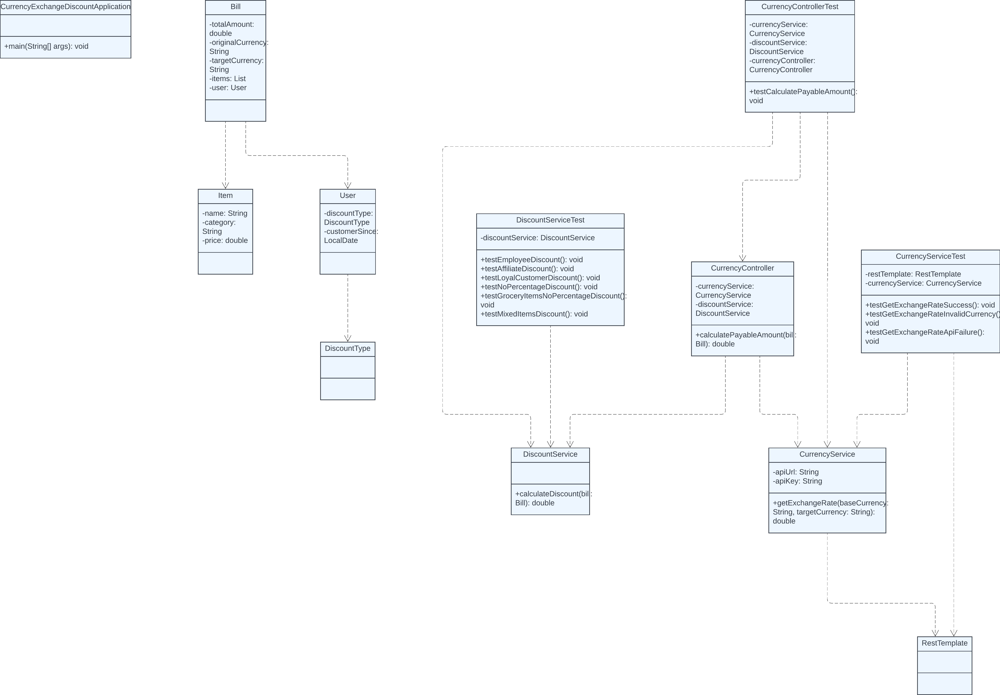

# Currency Exchange and Discount Calculation

## Description
This Spring Boot application integrates with a third-party currency exchange API to retrieve real-time exchange rates and calculates the total payable amount for a bill in a specified currency after applying applicable discounts.

## Requirements
- Java 17
- Gradle
- Spring Boot

## Setup
1. Clone the repository.
2. Update the `application.properties` file with your API key.
3. Build the project:
   ```sh
   ./gradlew build

## Run the application:
```sh 
   ./gradlew bootRun
```

## API Endpoint
POST /api/calculate
## Example Request Body:
```json
{
  "items": [
    {
      "name": "Biscuit",
      "category": "Grocery",
      "price": 100
    },
    {
      "name": "Shirt",
      "category": "Clothing",
      "price": 100
    }
  ],
  "totalAmount": 200,
  "originalCurrency": "USD",
  "targetCurrency": "EUR",
  "user": {
    "name": "John Doe",
    "discountType": "EMPLOYEE",
    "customerSince": "2020-01-01"
  }
}
```

## Example Response:
```json
{
"payableAmount": 153.0
}
```

## Testing
Run the tests:  
```sh
   ./gradlew test
```

## Code Coverage
Generate code coverage report:  
```sh
   ./gradlew jacocoTestReport
```
